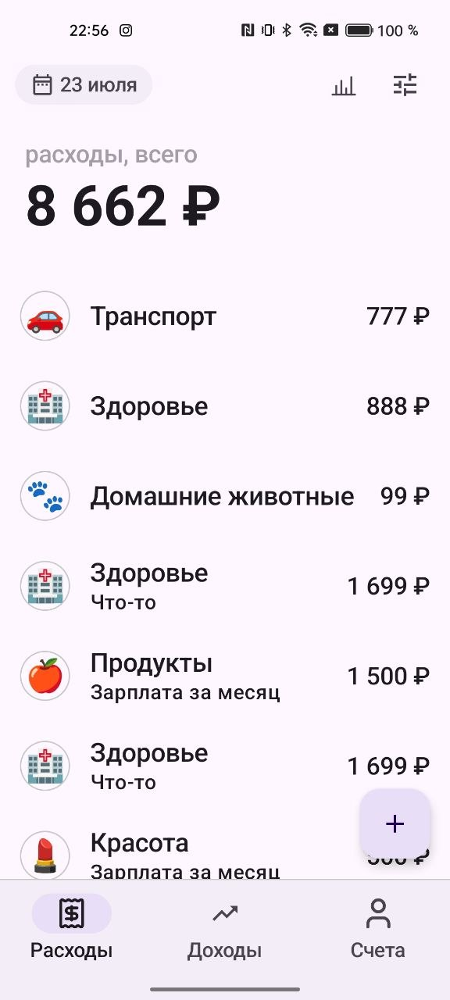
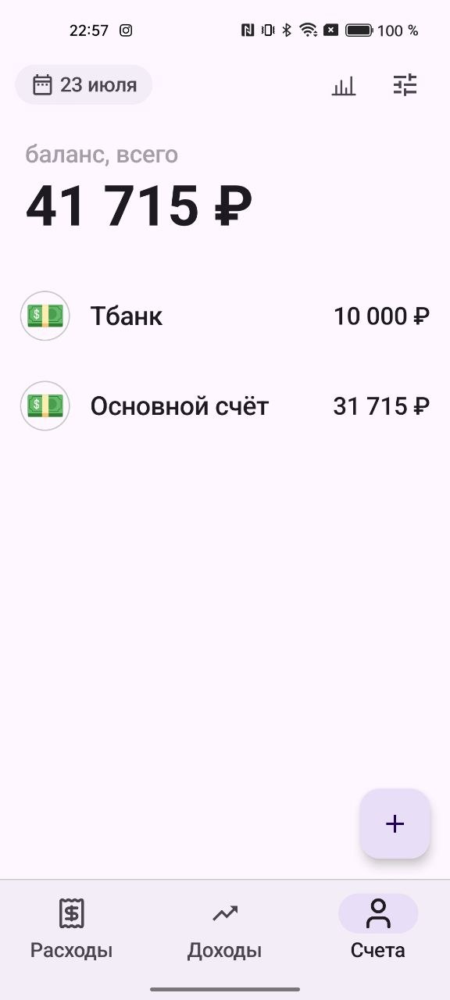
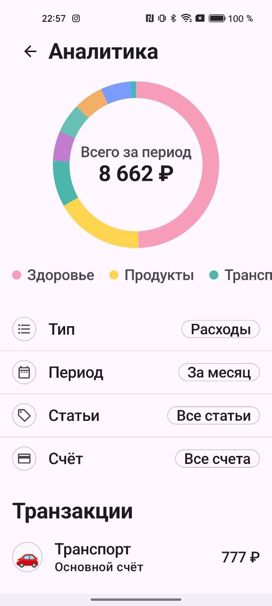
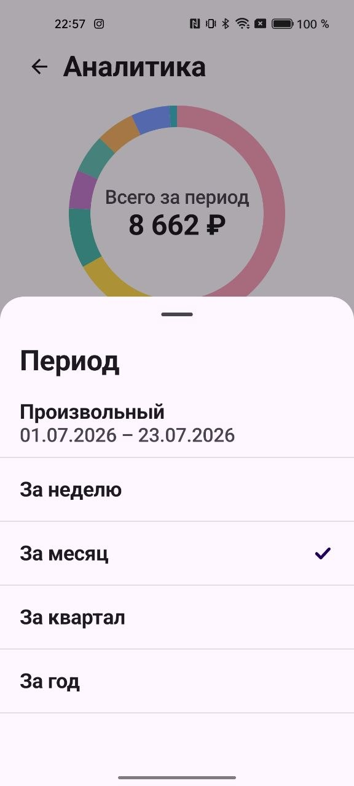
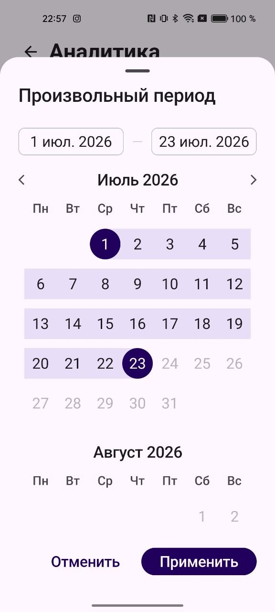
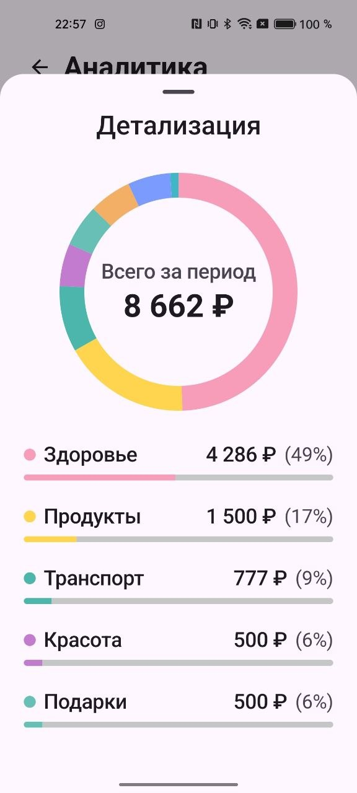

# FinanceApp

FinanceApp is an Android pet project for personal finance tracking. The app shows expenses, income, accounts and analytics, loads data from a backend API, handles network states and keeps UI logic separated from business and data layers.

The project is written as a portfolio app: the codebase demonstrates Compose UI, Clean Architecture, dependency injection, Retrofit networking, coroutine-based async work and focused unit tests.

## Screenshots

| Expenses | Income | Accounts |
| --- | --- | --- |
|  |  |  |

| Analytics | Period Filter | Custom Period |
| --- | --- | --- |
|  |  |  |

| Analytics Details |
| --- |
|  |

## Features

- Expenses, income and accounts screens.
- Analytics screen with filters by operation type, period, category and account.
- Donut chart with category distribution and a scrollable legend.
- Transaction list and analytics detail bottom sheets.
- Bottom navigation and horizontal swipes between main sections.
- Shared top bar with date, analytics and settings actions.
- Floating action button for adding operations.
- Pull-to-refresh for manual data reload.
- Silent lifecycle refresh for active screens.
- Splash screen with Lottie animation.
- Light and dark theme.
- Backend integration through Retrofit.
- Bearer token authorization.
- Centralized network error handling.
- Internet connection monitoring.
- Offline banner when the device has no connection.
- Retry policy for temporary network failures.
- Unit tests for domain and presentation mapping logic.

## Tech Stack

- Kotlin
- Jetpack Compose
- Material 3
- Android Architecture Components
- ViewModel
- Kotlin Coroutines and Flow
- Hilt
- Retrofit
- OkHttp
- Kotlinx Serialization
- JUnit
- MockK
- Lottie

## Architecture

The project follows a layered structure close to Clean Architecture:

```text
presentation -> domain -> data -> network
```

`presentation` contains Compose screens, UI state, ViewModel classes, navigation and reusable UI components.

`domain` contains business models, repository contracts and use cases. This layer does not depend on Android UI or Retrofit implementation details.

`data` contains repository implementations, DTO mapping and network result mapping.

`network` contains Retrofit API contracts, request/response DTOs, authentication, request execution, retry policy and network result types.

`core` contains shared infrastructure: theme tokens, coroutine dispatchers, helper functions and network monitoring.

## UI Layer

The UI is built with Jetpack Compose and Material 3. Screens use state objects and intent-style events, while ViewModels expose state through `StateFlow`.

Important UI areas:

- `presentation/main` - root app state and main screen orchestration.
- `presentation/navigation` - app routes and navigation graph.
- `presentation/analytics` - analytics screen, filters, chart and state mapping.
- `presentation/common/components/base` - shared base components.
- `presentation/common/placeholders` - loading, empty and error states.
- `presentation/common/network` - offline banner and lifecycle refresh helpers.

Bottom sheets are based on the shared `FinanceModalBottomSheet` component. This keeps modal behavior consistent across analytics filters and detail views.

## Domain Layer

The domain layer keeps the main business concepts:

- `Money`
- `Currency`
- `Transaction`
- `TransactionType`
- `Category`
- `FinancialAccount`
- `TransactionsQuery`
- `TransactionsOverview`
- `MainTransactionsOverview`
- `AnalyticsOverview`
- `FinancialAccountsOverview`

Use cases coordinate business scenarios such as loading main screen data, account overview data, analytics overview data and transaction overview data. ViewModels depend on use cases instead of directly calling repositories or network classes.

## Data And Network

The app uses Retrofit and OkHttp for backend communication. Requests go through a remote data source and a shared request executor, which keeps networking behavior consistent.

Network responsibilities include:

- adding `Authorization: Bearer ...` through an OkHttp interceptor;
- checking internet availability before requests;
- applying request timeout;
- retrying temporary failures;
- converting network responses into typed results;
- mapping DTOs into domain models.

Repository implementations hide the network layer from domain use cases. Mapping is explicit and kept in dedicated mapper classes.

## Error Handling

Network and data errors are converted into screen-friendly error states. The app can show:

- no internet state;
- server error state;
- timeout state;
- generic loading failure.

When the device has no valid internet connection, the root UI shows an offline banner. Manual retry is still available on error screens through the "Retry" action.

## Retry Policy

Temporary network failures are retried in one centralized place. The policy is intentionally simple and predictable:

- request timeout: 15 seconds;
- up to 3 retry attempts after the first request;
- fixed delay between retries: 2 seconds;
- retry for server errors, timeout and network failures;
- no retry for client errors such as `400`, `401` and `404`.

This prevents screens and use cases from duplicating retry logic.

## Tests

The project includes unit tests for:

- money model behavior;
- analytics overview use case;
- financial accounts overview use case;
- main overview use case;
- transactions overview use case;
- analytics filter UI mapping;
- analytics period resolving;
- analytics state mapping;
- real API smoke/integration scenarios.

Run tests:

```bash
./gradlew test
```

## How To Run

1. Clone the repository.
2. Open the project in Android Studio.
3. Create or update `local.properties` in the project root.
4. Add Android SDK path if Android Studio did not create it automatically:

```properties
sdk.dir=C\:\\Users\\User\\AppData\\Local\\Android\\Sdk
```

5. Add backend API token:

```properties
SHMR_API_TOKEN=your_token_here
```

Example:

```properties
sdk.dir=C\:\\Users\\User\\AppData\\Local\\Android\\Sdk
SHMR_API_TOKEN=your_token_here
```

`local.properties` is ignored by Git because it contains local machine settings and secrets.

After that, sync Gradle, choose an emulator or device and run the app from Android Studio.

## Project Highlights

- Clean separation between UI, domain logic and data access.
- ViewModels use domain use cases instead of accessing repositories directly.
- Shared Compose components reduce duplicated UI behavior.
- Theme values are centralized in the project theme layer.
- Network requests are executed through a common executor.
- Backend errors are mapped before reaching UI state.
- Analytics logic is isolated from composables through reducers and mappers.
- Tests cover business and presentation mapping logic.

## Roadmap

- Add transaction create and edit flows.
- Add account create and edit flows.
- Add local cache for offline read mode.
- Add UI tests for core user flows.
- Add GitHub Actions for automated checks.
- Add screenshots and demo video to the README.

## Repository Notes

The repository intentionally ignores local configuration, secrets and private working notes. Files such as `local.properties`, `secrets.properties`, `AGENTS.md` and `docs/` are not part of the public portfolio source.
