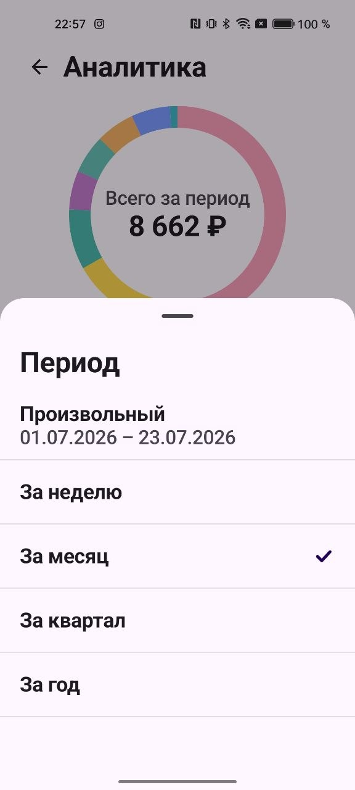
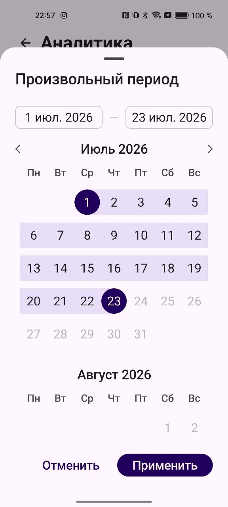
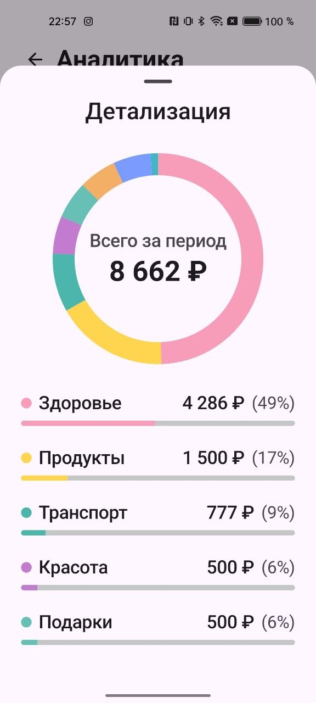

# FinanceApp

FinanceApp is an Android personal finance app built with Jetpack Compose. It tracks expenses, income, accounts and analytics, works with a backend API, keeps data available offline and synchronizes local changes when the network is back.

The project is written as a portfolio app: it demonstrates Clean Architecture, Compose UI, Hilt dependency injection, Retrofit networking, Room persistence, WorkManager synchronization, coroutine-based async work and focused unit tests.

## Screenshots

| Expenses | Income | Accounts |
| --- | --- | --- |
|  |  |  |

| Analytics | Period Filter | Custom Period |
| --- | --- | --- |
|  |  |  |

| Analytics Details |
| --- |
|  |

## Features

- Expenses, income, accounts and analytics in a single Compose app.
- Transaction create and edit flows for both expenses and income.
- Account create and edit flows with name, currency and balance updates.
- Analytics with filters by operation type, period, category and account.
- Offline-first data access through Room: previously loaded data remains available without internet.
- Offline transaction and account mutations saved locally and synchronized later.
- Periodic backend synchronization with WorkManager every 2 hours.
- Backend integration through Retrofit, OkHttp and Bearer token authorization.
- Network monitoring, offline banner and screen-level error states.
- Centralized retry policy for temporary failures, including HTTP 500.
- Light and dark theme, shared Compose components and MVI-style state handling.
- Unit tests for domain/use case logic and sync operation handlers.

## Tech Stack

- Kotlin
- Jetpack Compose
- Material 3
- ViewModel
- Kotlin Coroutines and Flow
- Hilt
- Retrofit
- OkHttp
- Kotlinx Serialization
- Room
- WorkManager
- JUnit
- MockK
- Lottie

## Architecture

The project follows a layered structure close to Clean Architecture:

```text
presentation -> domain -> data -> local / network / sync
```

`presentation` contains Compose screens, UI state, ViewModels, navigation and reusable UI components.

`domain` contains business models, repository contracts and use cases. This layer does not depend on Android UI, Retrofit, Room or WorkManager implementation details.

`data` contains repository implementations, DTO/entity mapping, local persistence, network data sources and synchronization logic.

`core` contains shared infrastructure such as theme tokens, coroutine dispatchers, helper functions and network monitoring.

## UI Layer

The UI is built with Jetpack Compose and Material 3. Screens use state objects and intent-style events, while ViewModels expose state through `StateFlow`.

Important UI areas:

- `presentation/main` - root state for expenses, income and accounts.
- `presentation/analytics` - analytics screen, filters, chart and state mapping.
- `presentation/bottomSheets/transactionEditor` - transaction create/edit flow.
- `presentation/bottomSheets/accountEditor` - account create/edit flow.
- `presentation/common/components/base` - shared base components.
- `presentation/common/placeholders` - loading, empty and error states.
- `presentation/common/network` - offline banner and lifecycle refresh helpers.

Bottom sheets are based on the shared `FinanceModalBottomSheet` component, which keeps modal behavior consistent across editors, filters and detail views.

## Domain Layer

The domain layer keeps the main business concepts:

- `Money`
- `Currency`
- `Transaction`
- `TransactionDraft`
- `TransactionType`
- `Category`
- `Account`
- `AccountDraft`
- `TransactionSummary`
- `AccountSummary`
- `TransactionAnalysis`

Main use cases:

- `TransactionUseCases` - load, create, update and delete transactions.
- `AccountUseCases` - load, create, update and delete accounts.
- `CategoryUseCase` - load transaction categories.
- `GetFinancialSummaryUseCase` - build data for the main expenses, income and accounts screens.
- `GetTransactionAnalysisUseCase` - build analytics data grouped by categories.
- `SynchronizationUseCases` - expose sync events and failed operation controls to UI.

ViewModels depend on use cases instead of directly calling repositories, network classes or Room DAOs.

## Data, Local And Network

The data layer hides data source details from domain use cases. Repositories decide whether to use the backend, read from Room or enqueue a local mutation for later synchronization.

Main repository implementations:

- `TransactionsDataRepository`
- `FinancialAccountsDataRepository`
- `CategoriesDataRepository`

Network responsibilities:

- adding `Authorization: Bearer ...` through an OkHttp interceptor;
- checking internet availability before requests;
- applying request timeout;
- retrying temporary failures;
- converting network responses into typed results;
- mapping DTOs into domain models.

All network calls go through `NetworkRequestExecutor`, so retry, timeout and network error mapping stay centralized.

## Offline Mode And Sync

Local data is stored in Room through `FinanceDatabase`.

Room tables:

- `accounts`
- `categories`
- `transactions`
- `sync_operations`

Offline-first behavior:

- successful backend responses refresh Room cache;
- when the network is unavailable or temporarily fails, repositories return cached Room data when possible;
- new offline entities are saved locally immediately;
- local-only entities use negative ids until the backend returns real ids;
- create, update and delete operations are recorded in `sync_operations`;
- pending operations are sent to the backend when synchronization runs.

Synchronization is implemented in `data/sync`.

Important classes:

- `SyncBootstrapper` - starts periodic sync and schedules sync when internet connection appears.
- `WorkManagerSyncWorkScheduler` - enqueues one-time and periodic sync work.
- `FinanceSyncWorker` - WorkManager worker entry point.
- `SyncCoordinator` - processes pending operations and refreshes server snapshots.
- `TransactionSyncOperationHandler` - syncs transaction create/update/delete operations.
- `AccountSyncOperationHandler` - syncs account create/update operations.
- `ServerSnapshotRefresher` - reloads fresh backend data after local mutations are synced.
- `SyncConflictResolver` - resolves local/server conflicts.

Periodic synchronization runs every 2 hours and requires `NetworkType.CONNECTED`.

## Error Handling And Retry

Network and data errors are converted into screen-friendly error states. The app can show:

- no internet state;
- server error state;
- timeout state;
- generic loading failure.

When the device has no valid internet connection, the root UI shows an offline banner. Manual retry is available on error screens through the retry action.

Temporary network failures are retried in one centralized place:

- request timeout: 15 seconds;
- up to 3 retry attempts after the first request;
- fixed delay between retries: 2 seconds;
- retry for HTTP 500, timeout and network failures;
- no retry for client errors such as `400`, `401` and `404`.

## Tests

The project includes unit tests for:

- money model behavior;
- transaction use cases;
- account use cases;
- financial summary use case;
- transaction analysis use case;
- transaction sync operation handler;
- account sync operation handler;
- sync conflict resolver;
- real API smoke/integration scenarios.

Run tests:

```bash
./gradlew test
```

## Project Highlights

- Clean separation between UI, domain logic and data access.
- ViewModels use domain use cases instead of accessing repositories directly.
- Shared Compose components reduce duplicated UI behavior.
- Theme values are centralized in the project theme layer.
- Network requests are executed through a common executor.
- Offline mutations are persisted locally and synchronized through WorkManager.
- Backend errors are mapped before reaching UI state.
- Analytics logic is isolated from composables through use cases, reducers and mappers.
- Tests cover business logic and synchronization behavior.

## Repository Notes

The repository ignores local configuration and secrets such as `local.properties`.
